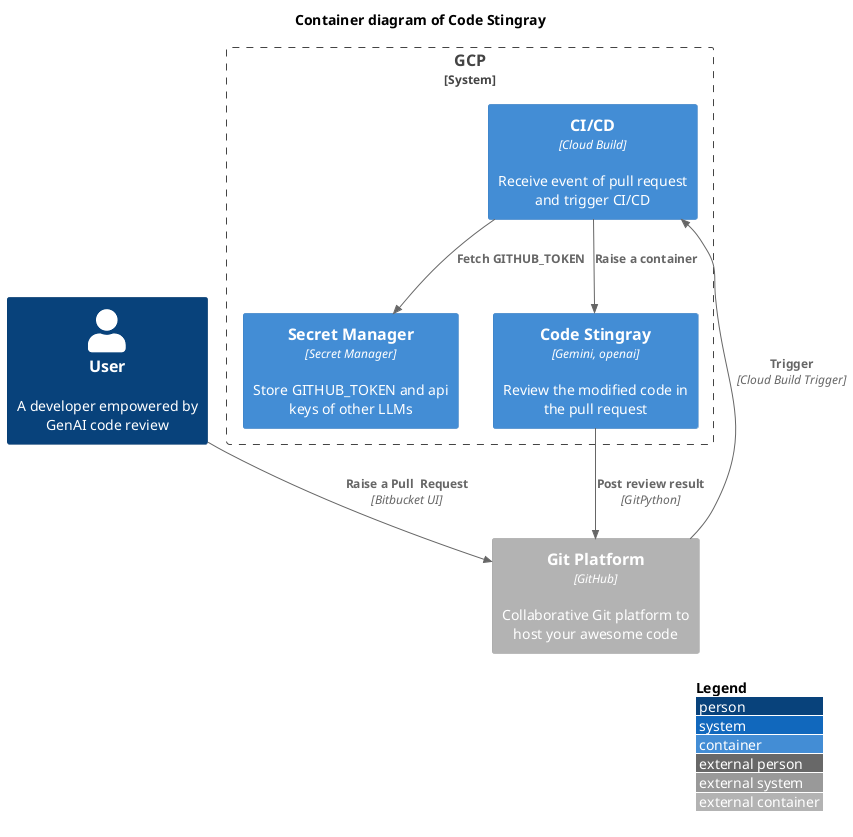

# Code Stingray

Code Stingray is a lightweight CLI that leverages GenAI for code review, seamlessly integrating with both GenAI models and CI/CD tools.

## Installation
Install with pip:
```bash
pip install git+https://github.com/mansunkuo/code-stingray.git@0.1.3
```

Or download the container:
```bash
docker pull ghcr.io/mansunkuo/code-stingray:0.1.3
```

## CLI usage
Code Stingray CLI helps you understand the impact of code changes by comparing two commits. It integrates with various platforms like Google Cloud and GitHub to provide context and streamline analysis within your development workflow.

This CLI has two levels of subcommands:
```bash
code-stingray <llm_provider> <git_platform>
```

You can get help message in each level. For example:
```bash
❯ code-stingray -h
usage: code-stingray [-h] [--log-level {DEBUG,INFO,WARNING,ERROR,CRITICAL}] (--path PATH | --remote_url REMOTE_URL) [--remote_branch REMOTE_BRANCH]
                     [--commit1 COMMIT1] [--commit2 COMMIT2]
                     {google_ai,google_cloud} ...

positional arguments:
  {google_ai,google_cloud}
                        Available LLM
    google_ai           Google AI LLM
    google_cloud        Google Cloud Vertex AI LLM
    openai              OpenAI LLM

options:
  -h, --help            show this help message and exit
  --log-level {DEBUG,INFO,WARNING,ERROR,CRITICAL}, -l {DEBUG,INFO,WARNING,ERROR,CRITICAL}
                        Set the logging level (default: INFO)
  --path PATH, -p PATH  Path to the local Git repository, a file or directory
  --remote_url REMOTE_URL, -ru REMOTE_URL
                        URL of the remote Git repository
  --remote_branch REMOTE_BRANCH, -rb REMOTE_BRANCH
                        Branch to clone from the remote repository
  --commit1 COMMIT1, -c1 COMMIT1
                        First commit hash of 'git diff commit1 commit2'
  --commit2 COMMIT2, -c2 COMMIT2
                        Second commit hash of 'git diff commit1 commit2'
❯ code-stingray google_ai -h
usage: code-stingray google_ai [-h] [--model MODEL] {github} ...

positional arguments:
  {github}       Git platform
    github       GitHub

options:
  -h, --help     show this help message and exit
  --model MODEL  LLM model name
❯ code-stingray google_cloud -h
usage: code-stingray google_cloud [-h] [--model MODEL] [--google_cloud_project GOOGLE_CLOUD_PROJECT] [--google_cloud_location GOOGLE_CLOUD_LOCATION]
                                  {github} ...

positional arguments:
  {github}              Git platform
    github              GitHub

options:
  -h, --help            show this help message and exit
  --model MODEL         LLM model name
  --google_cloud_project GOOGLE_CLOUD_PROJECT
                        Google Cloud Project
  --google_cloud_location GOOGLE_CLOUD_LOCATION
                        Google Cloud Location (default: us-west1))
❯ code-stingray openai -h
usage: code-stingray openai [-h] [--model MODEL] {github} ...

positional arguments:
  {github}       Git platform
    github       GitHub

options:
  -h, --help     show this help message and exit
  --model MODEL  LLM model name (default: gpt-4o-mini)
❯ code-stingray google_cloud github -h
usage: code-stingray google_cloud github [-h] [--github_token GITHUB_TOKEN] [--github_repo_owner GITHUB_REPO_OWNER] [--github_repo_name GITHUB_REPO_NAME]
                                         [--github_pr_number GITHUB_PR_NUMBER]

options:
  -h, --help            show this help message and exit
  --github_token GITHUB_TOKEN
                        GitHub personal access token
  --github_repo_owner GITHUB_REPO_OWNER
                        GitHub repository owner
  --github_repo_name GITHUB_REPO_NAME
                        GitHub repository name
  --github_pr_number GITHUB_PR_NUMBER
                        GitHub pull request number
```

## LLM Provider
### Google AI
Using Google AI just requires a Google account and an API key. Put your API key in a environment variable named `GOOGLE_API_KEY`. You can use available [Gemini models](https://ai.google.dev/gemini-api/docs/models/gemini) as the LLM for this project. 

### Google Cloud Vertex AI
Please make sure you already [set up a project and a development environment of VertexAI](https://cloud.google.com/vertex-ai/docs/start/cloud-environment). Please refer to [set up Application Default Credentials](https://cloud.google.com/docs/authentication/provide-credentials-adc) when you are on your laptop or any other environment outside GCP.

### OpenAI
Using OpenAI requires an API key of OpenAI. Put your API key in a environment variable named `OPENAI_API_KEY`. Please check [OpenAI pricing](https://openai.com/api/pricing/) for all available models and their pricing.

## Git Platform
### GitHub
You will need a Github Token to write review result to a pull request. Please refer to [Creating a fine-grained personal access token](https://docs.github.com/en/authentication/keeping-your-account-and-data-secure/managing-your-personal-access-tokens#creating-a-fine-grained-personal-access-token) and create a fine-grained personal access token with read and write access. Put this token in a environment variable named `GITHUB_TOKEN`.


## Example
For example, if you would like to review current repository:
```bash
git clone https://github.com/mansunkuo/code-stingray.git
cd code-stingray
export GOOGLE_API_KEY=YOUR_API_KEY  # Set your API key
code-stingray -l DEBUG -p . \
    -c1 cb2f381f6c0c776af3e8e30e8506913b30132327 \
    -c2 b4db6d843fb337241402116d763c9318a07d0227 \
    google_ai
```

To post the review result on a pull request:
```bash
# export GITHUB_TOKEN=YOUR_GITHUB_TOKEN  # Set your GitHub token
python -m code_stingray.cli -p . \ 
    -c1 cb2f381f6c0c776af3e8e30e8506913b30132327 \
    -c2 b4db6d843fb337241402116d763c9318a07d0227 \
    google_ai \
    github --github_token $GITHUB_TOKEN \
    --github_repo_owner mansunkuo \
    --github_repo_name code-stingray \
    --github_pr_number 1
```

## Architecture
### GCP with GitHub


<!-- https://kroki.io/#try


## References
- [Code Review Automation with Gemini @ DevFest Taipei 2024](https://docs.google.com/presentation/d/11gMdxddC4e2HHtDo-05i1_108vAZto5AihIay4gLz-k/edit?usp=sharing)

## License and Attribution
This project includes material from [genai-for-developers](https://github.com/GoogleCloudPlatform/genai-for-developers), licensed under the Apache License, Version 2.0. 
You can view the full license at http://www.apache.org/licenses/LICENSE-2.0