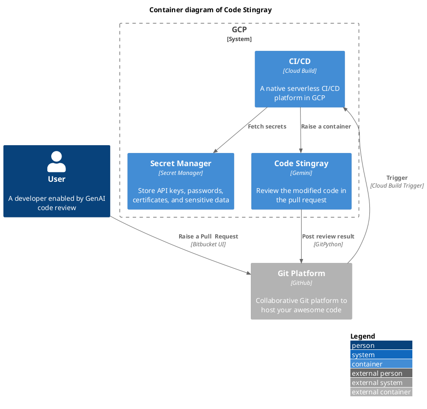

# code-stingray

code-stingray is a lightweight CLI that leverages GenAI for code review, seamlessly integrating with both GenAI models and CI/CD tools.

## Prerequisites
### Google
Please make sure you already [set up a project and a development environment of VertexAI](https://cloud.google.com/vertex-ai/docs/start/cloud-environment). You can use available [Gemini models](https://ai.google.dev/gemini-api/docs/models/gemini) as the LLM for this project. 

Please refer to [Workload Identity Federation](https://cloud.google.com/iam/docs/workload-identity-federation) or [set up Application Default Credentials](https://cloud.google.com/docs/authentication/provide-credentials-adc) when you are on your laptop or any other environment outside GCP.

<!-- ## Architecture


### Version Bump
```bash
bump2version major  # Bump major version
bump2version minor  # Bump minor version
bump2version patch  # Bump patch version 
```

## License and Attribution
This project includes material from [genai-for-developers](https://github.com/GoogleCloudPlatform/genai-for-developers), licensed under the Apache License, Version 2.0. 
You can view the full license at http://www.apache.org/licenses/LICENSE-2.0